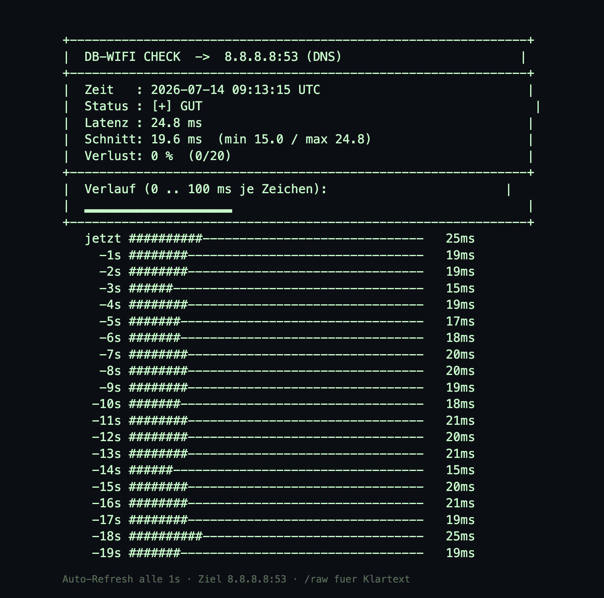

# DB-Wifi Check

Kleine Kubernetes-App, die im festen Intervall die Verbindung zu einem oder
**mehreren DNS-Servern** prüft, die Latenz misst und das Ganze darstellt — als
**ASCII-Grafik** im Log (`kubectl logs`) und als **modernes Web-Dashboard** auf
**Port 8080**.



## Neu in v0.3

- **Mehrere Ziele gleichzeitig** — per `TARGETS` (Komma-separiert, je `host:port`).
  Im Dashboard als **Tabs** mit eigener Status-Ampel je Ziel.
- **Persistenter Verlauf** — die Messwerte werden auf ein Volume (`DATA_DIR`)
  geschrieben und beim Start wieder geladen, überleben also Pod-Neustarts.
  Ist das Verzeichnis nicht beschreibbar, schaltet die App automatisch auf
  „nur im Speicher" (Anzeige oben rechts im Dashboard).
- **Knopf „Verlauf löschen"** je Ziel (`/clear`).

Aus v0.2: modernes Dashboard, Live-Countdown, Knopf „Jetzt messen" (`/probe`),
PDF-Export (Druckansicht), JSON-Endpunkt `/data`.

Weiterhin: nur Python-Standardbibliothek, kein eigenes Image, restricted-konform.

## Warum kein ICMP-Ping?

Der Cluster (`docker-lab`, Talos) erzwingt die **restricted**-PodSecurity-Policy.
Die verbietet die Capability `NET_RAW`, die ein echter ICMP-Ping bräuchte.
Deshalb misst die App die Erreichbarkeit + Latenz per **TCP-Connect zum
DNS-Port 1.1.1.1:53** — gleiche Aussage (erreichbar? wie schnell?), aber ganz
ohne Sonderrechte, als Nicht-Root.

## Warum kein eigenes Image?

`docker-lab` ist ein Talos-in-Docker-Cluster mit mehreren Nodes und **ohne
Registry** — ein lokal gebautes Image kennen die Nodes nicht. Statt das Image
zu verteilen, läuft die App im **öffentlichen `python:3.12-slim`** (das der
Cluster selbst zieht); der Code (`app/check.py`, reine Standardbibliothek)
wird als **ConfigMap** eingehängt. Kein Build, keine Registry.

## Aufbau

```
db-wifi-check/
├── app/check.py      # TCP-Check + Web-Dashboard + ASCII-Log + HTTP-Server (nur stdlib)
├── k8s.yaml          # PVC + Deployment (restricted-konform) + Service :8080
├── deploy.sh         # ConfigMap + Apply + Rollout + Port-Forward
├── Dockerfile        # optional: nur falls du doch ein eigenes Image bauen willst
├── storage/          # local-path-provisioner (Talos-tauglich) fuer die PVC
└── README.md
```

## Persistenter Verlauf

Die App legt den Verlauf als `history.json` unter `DATA_DIR` (Default `/data`)
ab und lädt ihn beim Start wieder — so bleiben die Messwerte über Pod-Neustarts
erhalten. Dafür mountet `k8s.yaml` ein **PersistentVolumeClaim** (128 Mi) nach
`/data`; `fsGroup: 10001` sorgt dafür, dass der Nicht-Root-User hineinschreiben
darf.

> **Ohne Default-StorageClass** (z. B. blankes Talos wie `docker-lab`) bleibt die
> PVC `Pending` und der Pod startet nicht (`FailedScheduling: unbound immediate
> PersistentVolumeClaims`). Zwei Auswege:
>
> **a) StorageClass installieren (empfohlen, echte Persistenz).** Das mitgelieferte,
> Talos-taugliche `local-path-provisioner`-Manifest anwenden und als Default markieren:
>
> ```bash
> kubectl apply -f storage/local-path-provisioner.talos.yaml
> kubectl patch storageclass local-path \
>   -p '{"metadata":{"annotations":{"storageclass.kubernetes.io/is-default-class":"true"}}}'
> # danach den haengenden Pod neu anstossen, damit die PVC bindet:
> kubectl delete pod -l app=db-wifi-check
> ```
>
> **b) `emptyDir`-Fallback.** In `k8s.yaml` das Volume `data` von
> `persistentVolumeClaim` auf `emptyDir: {}` umstellen. Läuft ohne Persistenz über
> Pod-Neustarts hinweg — die App erkennt das selbst und zeigt „Verlauf: nur im Speicher".

Verlauf löschen: im Dashboard der Knopf **„Verlauf löschen"** (je Ziel), per
API `curl -X POST 'localhost:8080/clear?target=8.8.8.8:53'` (ohne `target`
werden alle Ziele geleert).

## Deployen

```bash
cd db-wifi-check
KUBE_CONTEXT=admin@docker-lab ./deploy.sh
```

Danach im Browser: **http://localhost:8080**

> Anderer Kontext? Einfach `KUBE_CONTEXT=<name> ./deploy.sh`
> (`kubectl config get-contexts` zeigt die verfügbaren).

### Manuell

```bash
kubectl config use-context admin@docker-lab
kubectl create configmap db-wifi-check-src --from-file=check.py=app/check.py \
  --dry-run=client -o yaml | kubectl apply -f -
kubectl apply -f k8s.yaml
kubectl rollout restart deploy/db-wifi-check
kubectl rollout status deploy/db-wifi-check
kubectl port-forward svc/db-wifi-check 8080:8080
```

## Endpunkte

| Pfad       | Inhalt                                                        |
|------------|--------------------------------------------------------------|
| `/`        | Web-Dashboard (Tabs, Countdown, Refresh, PDF, Löschen)       |
| `/data`    | JSON mit allen Zielen, Kennzahlen und Countdown              |
| `/probe`   | misst sofort alle Ziele, liefert das frische JSON (auch `POST`) |
| `/clear`   | leert den Verlauf (`?target=host:port` für ein Ziel, sonst alle) |
| `/raw`     | reiner ASCII-Text (`curl localhost:8080/raw`)                |
| `/healthz` | Liveness-/Readiness-Probe                                    |

## Konfiguration (Env-Variablen im Deployment)

| Variable           | Default             | Bedeutung                                   |
|--------------------|---------------------|---------------------------------------------|
| `TARGETS`          | `8.8.8.8:53,1.1.1.1:53` | Ziele, Komma-separiert (`host:port`, Port optional) |
| `TARGET`           | `8.8.8.8`           | Einzel-Ziel (Fallback, falls `TARGETS` leer)|
| `PROBE_PORT`       | `53`                | Default-TCP-Port, wenn im Ziel keiner steht |
| `INTERVAL_SECONDS` | `30`                | Prüf-Intervall                              |
| `TIMEOUT_SECONDS`  | `2`                 | Connect-Timeout                             |
| `HISTORY`          | `20`                | gespeicherte Messungen je Ziel              |
| `DATA_DIR`         | `/data`             | Ablage für den persistenten Verlauf         |
| `MAX_MS`           | `100`               | ms = volle Balkenbreite                     |
| `PORT`             | `8080`              | HTTP-Port                                   |

## Code ändern

`app/check.py` bearbeiten und `deploy.sh` erneut laufen lassen — die ConfigMap
wird aktualisiert und der Pod automatisch neu gestartet.

## Logs / Aufräumen

```bash
kubectl logs -f deploy/db-wifi-check
kubectl delete -f k8s.yaml
kubectl delete configmap db-wifi-check-src
```

## Changelog

### v0.3
- Mehrere Ziele gleichzeitig (`TARGETS`), im Dashboard als Tabs.
- Persistenter Verlauf auf ein Volume (`DATA_DIR`), lädt beim Start; Fallback
  auf „nur im Speicher", wenn nicht beschreibbar.
- Knopf „Verlauf löschen" je Ziel (`/clear`).
- `k8s.yaml`: PVC + `/data`-Mount, `fsGroup`, `Recreate`-Strategie.

### v0.2
- Schickeres Web-Dashboard (Karten, SVG-Verlaufsdiagramm, Status-Ampel, DB-Rot).
- Live-Countdown bis zur nächsten Messung.
- Knopf für sofortige, händische Messung (`/probe`).
- PDF-Export aus dem Browser (Druckansicht).
- JSON-Endpunkt `/data`; Auto-Refresh nun per JS statt `<meta refresh>`.

### v0.1
- TCP-Latenz-Check als ASCII-Dashboard im Log und Web-Interface (Port 8080),
  restricted-PodSecurity-konform, ohne eigenes Image (Code via ConfigMap).
